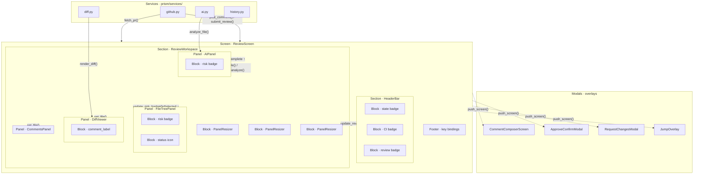

# Components

In Prism, **components** are Textual `Widget` subclasses — the visual and interactive building blocks of the UI. The term "component" is used broadly to mean any reusable widget, regardless of its specific role.

Components are organized under `prism/components/` by their level of abstraction. The naming convention — blocks, panels, sections, modals — exists to create a clear vocabulary for building and composing interfaces: each category has a well-defined scope, which makes it easier to reason about where new UI should live and how existing pieces can be reused.

---

## Category Overview

```
prism/components/
├── blocks/    # Atomic helpers: badges, labels, utilities
├── panels/    # Single-purpose content areas
├── sections/  # Composite layouts built from panels
└── modals/    # Overlay dialogs (screen-level)
```

---

## Blocks

**What they are:** The smallest unit. Blocks are not widgets on their own — they are helper functions, constants, and tiny utility widgets that other components consume.

**Rule of thumb:** If it renders a badge, formats a label, or provides a drag handle, it's a block.

| File | Purpose |
|---|---|
| `badges.py` | Style constants for PR state, CI status, review state, and AI risk labels |
| `comment_item.py` | `comment_label()` — formats a single review comment as a Rich Text preview |
| `resizer.py` | `PanelResizer` — 1-cell drag handle for resizing adjacent panels |

Blocks have no awareness of application state. They receive data as arguments and return styled output.

---

## Panels

**What they are:** Single-purpose content widgets that own and display one type of data. A panel knows how to fetch or receive its data, render it, and post messages when the user interacts with it.

**Rule of thumb:** If it displays one cohesive piece of PR information (file tree, diff, comments, AI analysis), it's a panel.

| File | Class | Displays |
|---|---|---|
| `file_tree.py` | `FileTreePanel` | Changed files grouped by directory, with status icons and risk badges |
| `diff_viewer.py` | `DiffViewer` | Unified diff for the selected file, with syntax highlighting via `delta` |
| `comments_panel.py` | `CommentsPanel` | PR reviews (Approved / Changes Requested) and per-file inline comments |
| `comment_list.py` | `CommentList` | Focused list of inline comments for a file, nested replies included |
| `ai_panel.py` | `AIPanel` | Claude AI analysis: risk level, concerns, and suggested comment for the selected file |

Panels communicate upward via Textual messages (e.g., `FileTreePanel.FileSelected`, `AIPanel.AnalysisComplete`). They never call into sibling panels directly — the parent screen wires them together.

---

## Sections

**What they are:** Composite widgets that group two or more panels into a meaningful layout. A section is still a reusable widget — it can be embedded in any screen — but its job is composition, not standalone display.

**Rule of thumb:** If it places multiple panels side by side and glues their interaction, it's a section.

| File | Class | Composition |
|---|---|---|
| `pr_list_widget.py` | `PRListWidget` | DataTable of PRs with relative timestamps, state badges, and CI/review icons |
| `pr_preview_widget.py` | `PRPreviewWidget` | Detail sidebar for the highlighted PR (title, branches, author, body excerpt) |
| `pr_browser.py` | `PRBrowserSection` | `PRListWidget` + `PRPreviewWidget` side by side — a self-contained PR browser |
| `header_bar.py` | `HeaderBar` | Top bar for the review screen: PR title, state, CI status, branch info |
| `review_workspace.py` | `ReviewWorkspace` | Full review layout: `FileTreePanel` + `DiffViewer` + `CommentsPanel` + `AIPanel` with `PanelResizer` handles between them |

`ReviewWorkspace` is a good example of why sections exist: the arrangement of review panels (with resizable dividers) can be composed once and reused without duplicating layout logic.

---

## Modals

**What they are:** Full `Screen` subclasses used as overlays. Modals pause the parent screen, collect input or confirmation, and return a result via Textual's `push_screen` / callback mechanism.

**Rule of thumb:** If it blocks interaction with the rest of the app until dismissed, it's a modal.

| File | Class | Returns |
|---|---|---|
| `new_pr.py` | `NewPRScreen` | `(repo_slug, pr_number)` or `None` |
| `comment_composer.py` | `CommentComposerScreen` | `Comment` or `None` |
| `reply_composer.py` | `ReplyComposer` | Reply body string or `None` |
| `review_modals.py` | `QuitConfirmModal` | `bool` |
| `review_modals.py` | `ApproveConfirmModal` | `bool` |
| `review_modals.py` | `RequestChangesModal` | Message string or `None` |
| `jump_overlay.py` | `JumpOverlay` | Target `Widget` or `None` |

---

## Services

Services live under `prism/services/` and contain all logic that touches external systems or disk. They are plain Python modules — no Textual, no widgets.

**Rule of thumb:** If it makes a network call, reads/writes a file, or shells out to a process, it belongs in a service.

| File | Responsibility |
|---|---|
| `github.py` | GitHub API: fetch PRs, files, comments, reviews; post comments; submit reviews |
| `ai.py` | Claude AI analysis: call Claude Code CLI or Anthropic SDK, parse response, cache to disk |
| `diff.py` | Render unified diffs as Rich Text via `delta` or plain +/- fallback |
| `history.py` | Read/write local PR history at `~/.config/prism/history.json` |

Components never import services directly inside their class body. Screens call services (usually inside `@work(thread=True)` workers) and pass the results down to components via method calls or reactive updates.

---

## Composition Hierarchy

```
Blocks
  └─ consumed by Panels and Sections

Panels
  └─ embedded in Sections and Screens

Sections
  └─ embedded in Screens

Modals (Screens)
  └─ pushed by Screens

Services
  └─ called by Screens (inside workers, never on the main thread)
```

Screens (`prism/screens/`) are the only layer that is allowed to orchestrate across multiple panels and call services. A panel or section should never need to know which screen it lives in.

---

## TUI Layout Diagram

The diagram below shows how all layers fit together in `ReviewScreen`, the most complete screen in the application. Arrows represent the direction of data or control flow.



### Reading the diagram

| Arrow type | Meaning |
|---|---|
| `──►` solid | Active call: the source invokes the target (data flows in arrow direction) |
| `·····►` dashed | Overlay push: the screen suspends and waits for the modal's callback result |

Key observations:

- **Services never touch the UI.** They are called by the Screen inside background workers (`@work(thread=True)`) and hand results back via `call_from_thread`.
- **Panels never talk to each other.** A panel emits a message upward (`FileSelected`, `AnalysisComplete`); the Screen receives it and calls methods on the other panels that need to react.
- **Blocks are consumed silently.** Badges and labels are rendered inline — they have no messages or state of their own.
- **Sections are transparent containers.** `ReviewWorkspace` composes panels and resizers but does not mediate their communication; that still flows through the Screen.
- **Modals are fire-and-forget overlays.** The Screen pushes a modal and supplies a callback; when the modal dismisses it calls back with its result.
